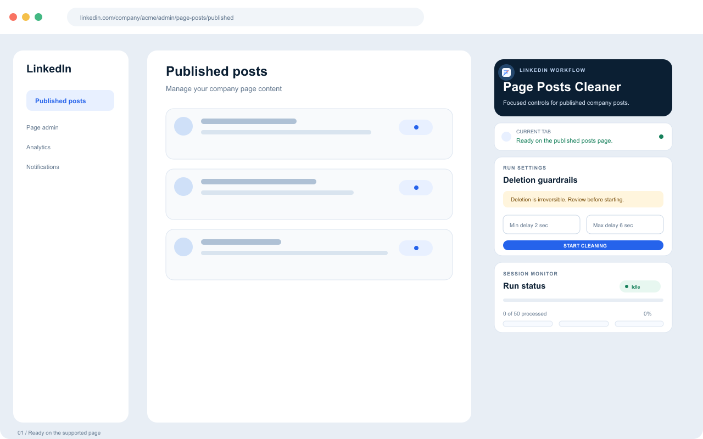
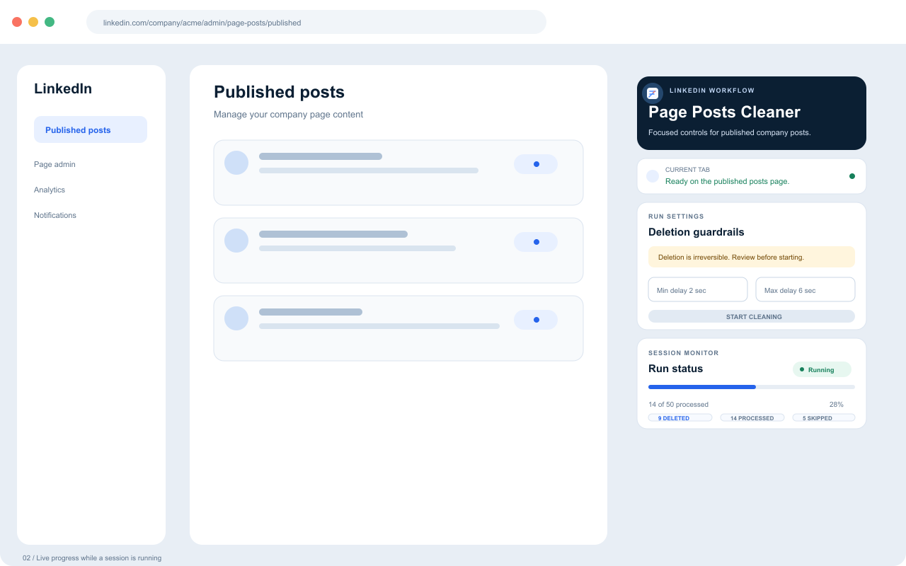
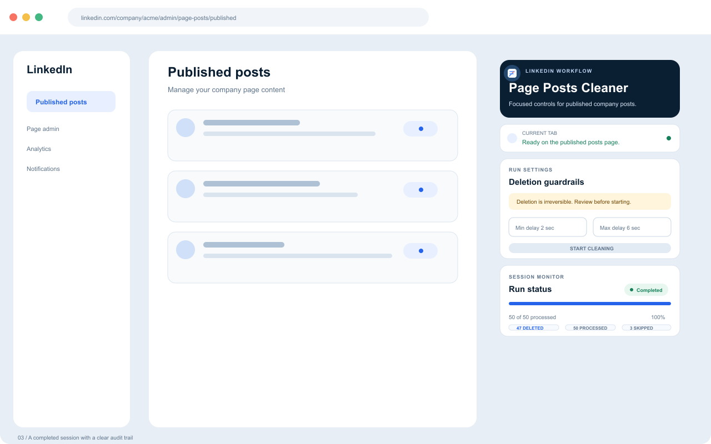

  
  <h1>LinkedIn Page Posts Cleaner</h1>
  
<strong>A focused Chrome extension for deliberate cleanup of published LinkedIn company posts.</strong>

  

    <a href="https://ismailco.github.io/linkedin-page-posts-cleaner/">Landing page</a>
    ·
    <a href="https://ismailco.github.io/linkedin-page-posts-cleaner/privacy.html">Privacy policy</a>
    ·
    <a href="https://github.com/Ismailco/linkedin-page-posts-cleaner/issues">Report an issue</a>
  

  

    
    
    
    
  

  

## Why this exists

Removing old company-page posts one by one is repetitive, but deletion is also irreversible. Page Posts Cleaner keeps the workflow intentionally narrow: open the supported LinkedIn admin page, choose the pacing and session limit, then watch exactly what the extension is doing.

It uses the existing page controls through DOM interactions. There is no server, no remote code, no analytics layer, and no separate dashboard to maintain.

## Highlights

- **Measured pacing** — configure a 2–6 second randomized delay between actions.
- **A hard session limit** — stop automatically after the number of posts you choose.
- **Live progress** — see deleted, processed, skipped, and current status from the popup.
- **A visible stop control** — end a session while it is running.
- **Narrow page scope** — the content script matches only the published company Page Posts admin route.
- **Local-first behavior** — settings and session state stay in `chrome.storage.local`.
- **Manifest V3** — packaged as a modern Chrome extension with no remote JavaScript.

## How it works

1. Open a company’s published posts admin page on LinkedIn.
2. Open the extension popup and confirm the current tab is supported.
3. Set the minimum and maximum delay plus a session limit.
4. Start the session and monitor the counters.
5. Stop whenever needed, or let the limit end the run.

<table>
  <tr>
    <td></td>
    <td></td>
    <td></td>
  </tr>
  <tr>
    <td align="center">Ready with guardrails</td>
    <td align="center">Running with progress</td>
    <td align="center">Completed with a clear summary</td>
  </tr>
</table>

## Privacy and permissions

The extension does not send page content, post data, or settings to a developer-controlled server. It operates locally in the active browser tab and stores only configuration and session state needed to render the popup.

| Permission | Why it is needed |
| --- | --- |
| `activeTab` | Check and use the currently active LinkedIn admin tab when a session starts. |
| `scripting` | Inject the packaged content script into the supported page. |
| `storage` | Persist delay settings, session limits, and progress state locally. |
| `https://www.linkedin.com/*` | Permit operation on LinkedIn; the content script itself is restricted to the published Page Posts admin route. |

Read the complete [privacy policy](https://ismailco.github.io/linkedin-page-posts-cleaner/privacy.html).

## Load locally

1. Clone or download this repository.
2. Open `chrome://extensions` in Chrome.
3. Enable **Developer mode**.
4. Select **Load unpacked** and choose the repository folder.
5. Open a supported LinkedIn company admin published-posts page.
6. Open the extension popup and review the target page and session limit before starting.

There is no build step or dependency install. The runtime is the root extension files plus `assets/icons/`.

## Repository map

| Path | Purpose |
| --- | --- |
| `manifest.json` | Manifest V3 metadata, permissions, routes, and icons. |
| `popup.html` / `popup.js` | Popup interface, controls, progress, and activity log. |
| `background.js` | Popup messaging, tab validation, and persisted session state. |
| `content.js` | Page-scoped DOM interaction and cleanup loop. |
| `assets/` | Source artwork and toolbar/runtime icons. |
| `store-assets/` | Chrome Web Store screenshots, promo art, and source layouts. |
| `release/` | Ready-to-upload extension package. |
| `site/` | Static landing page and privacy policy deployed to GitHub Pages. |

## Store package

The current package is [`release/linkedin-page-posts-cleaner.zip`](release/linkedin-page-posts-cleaner.zip). Store artwork and source files are documented in [`store-assets/README.md`](store-assets/README.md).

## Design principles

- Keep the extension’s job narrow and understandable.
- Make irreversible actions visible before they start.
- Keep progress and errors legible at a glance.
- Prefer browser-local behavior over a service or account system.
- Preserve the existing page workflow instead of introducing an alternate dashboard.

## Limitations

- This is a Chrome extension and currently targets the exact LinkedIn company published-posts admin route.
- LinkedIn UI changes may require selector maintenance over time.
- Deletions are irreversible; review the page and limits before starting a session.
- The extension is independent and is not affiliated with LinkedIn Corporation.

## Contributing

Bug reports, focused improvements, and clear reproduction steps are welcome. See [`CONTRIBUTING.md`](CONTRIBUTING.md) before opening an issue or pull request.

  Built for focused, visible, local-first cleanup.

